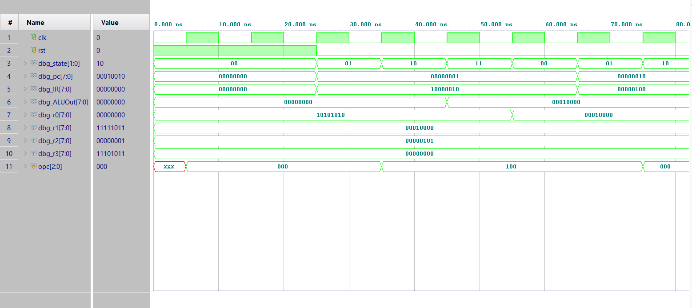
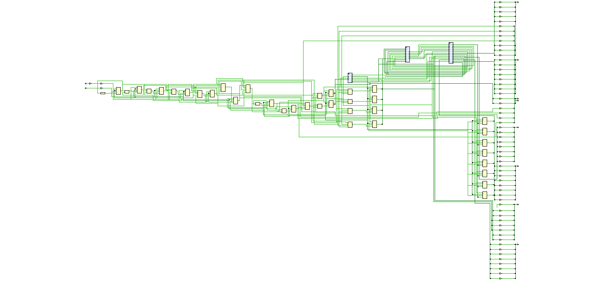

# Custom 8-bit Microprocessor

A custom 8-bit RISC-style microprocessor designed in Verilog HDL, following a classic 4-stage FSM architecture (FETCH → DECODE → EXEC → WRITEBACK). Verified through testbench-driven simulation and waveform analysis.

## Architecture

- **4 general-purpose registers** (R0–R3), 8 bits wide
- **ALU** supporting ADD, SUB, AND, OR, and MOV
- **Hardcoded 5-instruction program memory** (ROM-style), used to demonstrate the datapath
- **Single control unit** driving a classic 4-state Moore FSM

### Instruction Format

Each instruction is 8 bits wide:

| Bits  | Field    | Description              |
|-------|----------|---------------------------|
| [7:5] | opcode   | Operation to perform       |
| [4:3] | rd       | Destination register        |
| [2:1] | rs       | Source register              |
| [0]   | unused   | Reserved                     |

### ISA (Instruction Set)

| Opcode | Mnemonic | Operation           |
|--------|----------|----------------------|
| 000    | ADD      | rd = rd + rs          |
| 001    | SUB      | rd = rd - rs           |
| 010    | AND      | rd = rd & rs            |
| 011    | OR       | rd = rd \| rs             |
| 100    | MOV      | rd = rs                    |

### Demo Program (hardcoded in `program_memory`)

| PC | Instruction        |
|----|----------------------|
| 0  | MOV R0 = R1            |
| 1  | ADD R0 = R0 + R2        |
| 2  | SUB R3 = R3 - R0         |
| 3  | OR  R1 = R1 \| R3          |
| 4  | AND R2 = R2 & R1            |

Initial register values: `R0 = 0xAA`, `R1 = 0x10`, `R2 = 0x05`, `R3 = 0x00`.

## FSM Stages

```
FETCH  → increments PC, loads instruction into IR
DECODE → decodes opcode, rd, rs
EXEC   → ALU computes result
WRITEBACK → result written back to register file
```

## Files

- `processor.v` — top-level processor module and all submodules (ALU, register file, control unit, program memory)
- `testbench.v` — self-checking testbench with human-readable `$display` traces (state, PC, IR, opcode, ALU output, and all register values every clock cycle) and VCD waveform dump

## Running the Simulation

Designed and simulated in **Xilinx Vivado**:

1. Create a new Vivado project and add `processor.v` as a design source and `testbench.v` as a simulation source
2. Set `tb_debug` as the top module for simulation
3. Run **Behavioral Simulation**

The testbench prints a per-cycle trace (FSM state, program counter, opcode, ALU output, and all register values) to the Tcl console, and dumps `cpu_debug.vcd` for waveform viewing in the Vivado waveform viewer.

The design was also synthesized and verified on a **Digilent Nexys A7 FPGA**, confirming correct behavior beyond simulation.

## Verified Behavior

Simulation confirms the datapath executes all 5 instructions correctly across the FETCH-DECODE-EXEC-WRITEBACK cycle, with register values updating as expected at each step (e.g. `R0: 0xAA → 0x10 → 0x15` after MOV and ADD).

### Simulation Waveform



### Elaborated Schematic



> Note: the demo program has no HALT instruction — once PC advances past the last defined instruction, the processor falls through to a default no-op and continues incrementing PC, which is expected behavior for this scope.

## Author

Ishan Khan — B.Tech ECE, Aligarh Muslim University
